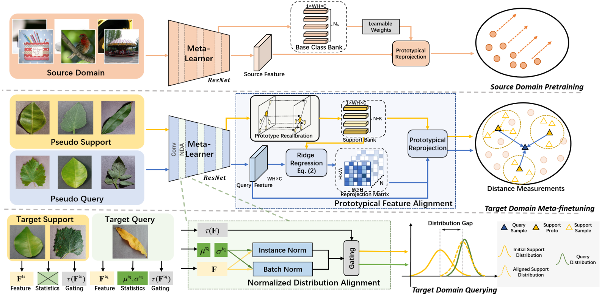

#  Dual Adaptive Representation Alignment for Cross-domain Few-shot Learning

PyTorch implementation of:

Dual Adaptive Representation Alignment for Cross-domain Few-shot Learning

Yifan Zhao, Tong Zhang, Jia Li, Yonghong Tian

## Abstract

Few-shot learning aims to recognize novel queries with limited support samples by learning from base knowledge. Recent progress on this setting assumes that the base knowledge and novel query samples are distributed in the same domains, which are usually infeasible for realistic applications. Toward this issue, we propose to address the cross-domain few-shot learning problem where only extremely few samples are available in target domains. Under this realistic setting, we focus on the fast adaptation capability of meta-learners by proposing an effective dual adaptive representation alignment approach. In our approach, a prototypical feature alignment is first proposed to recalibrate support instances as prototypes and reproject these prototypes with a differentiable closedform solution. Therefore feature spaces of learned knowledge can be adaptively transformed to query spaces by the cross-instance and cross-prototype relations. Besides the feature alignment, we further present a normalized distribution alignment module, which exploits prior statistics of query samples for solving the covariant shifts among the support and query samples. With these two modules, a progressive meta-learning framework is constructed to perform the fast adaptation with extremely few-shot samples while maintaining its generalization capabilities. Experimental evidence demonstrates our approach achieves new state-of-the-art results on both 4 CDFSL benchmarks and 4 fine-grained cross-domain benchmarks.



## Dependencies

- Python 3.8
- PyTorch 1.11.0 or higher
- torchvison 0.12.0 or higher
- numpy
- yacs
- tqdm

### Preparing Datasets

We use miniImageNet as the single source domain, and use eight representative benchmark datasets as the target domains. We list all the datasets used as follows..

| Dataset name                                                | Meta-class       | # images | # categories | Direct                                                |
| ------------------------------------------------------------ | ---- | ---------------- | ------------ | ------------------------------------------------------------ |
| [mini-ImageNet](http://madm.dfki.de/downloads/)  | Natural Images            | 38400      | 64       | https://drive.google.com/file/d/0B3Irx3uQNoBMQ1FlNXJsZUdYWEE/view |
| [EuroSAT](http://madm.dfki.de/downloads/)  | Satellite Images            | 27,000   | 10          | http://madm.dfki.de/files/sentinel/EuroSAT.zip |
| [ISIC2018](http://challenge2018.isic-archive.com)  | Dermoscopic          | 10,015   | 7          | https://challenge.isic-archive.com/data#2018 |
| [Plant Disease](https://www.kaggle.com/saroz014/plant-disease/)  | Plant Disease            | 43,456   | 38          | command line `kaggle datasets download -d plant-disease/data` |
| [ChestX-Ray8](https://www.kaggle.com/nih-chest-xrays/data)  | x-ray            | 25,848   | 7          | command line `kaggle datasets download -d nih-chest-xrays/data` |
| [Cars](https://ai.stanford.edu/~jkrause/cars/car_dataset)  | Cars            | 8,144   | 196         | http://ai.stanford.edu/~jkrause/car196/cars_train.tgz |
| [CUB](http://www.vision.caltech.edu/datasets/cub_200_2011)  | Birds        | 11,788    | 200         | https://s3.amazonaws.com/fast-ai-imageclas/CUB_200_2011.tgz |
| [Places](http://places2.csail.mit.edu/)  | Place      | 1,803,460    | 365         | http://data.csail.mit.edu/places/places365/places365standard_easyformat.tar |
| [Plantae](https://github.com/visipedia/inat_comp/tree/master/2018)  | Plant            | 127,551   | 2,917         | http://vllab.ucmerced.edu/ym41608/projects/CrossDomainFewShot/filelists/plantae.tar.gz |


#### Organizing Datasets

Place the downloaded dataset in the corresponding folder in `/data` and unzip it. We provide the meta-data file of the datasets in `metadata/`, and the train list and the test list are also provided according to the official splittings of the dataset. There is no need to modify the decompressed directory of the dataset. The following is an example of the directory structure of two datasets.

```
data
├── mini-ImageNet
│   ├── images
│   │   │── 001.Black_footed_Albatross
│   │   └── ···
│   └── ···
├── eurosat
│   ├── 2750
│   │   ├── AnnualCrop
│   │   │   ├── AnnualCrop_1.jpg
│   │   │   └── ···
│   └── ···
└── ···

```

#### Configuring Datasets

When using different datasets, you need to modify the dataset path in the corresponding config file. 
- `root_dir` :  the path to the image folder in `data/`. 
- `meta_dir` :  the path to the meta-data directory which contains train list or test list. 

Here are two examples corresponding to training and testing respectively.
  
```
dataset:
  name: mini-ImageNet
  root_dir: data/mini-ImageNet
  meta_dir: metadata/mini-ImageNet
```

```
dataset:
  name: eurosat
  root_dir: data/eurosat
  meta_dir: metadata/eurosat
```

> Note that the path of the meta-data directory should match the path of `root_dir`. 

### Training

We provide separate training files in the `trainer/` directory. For training our model, please run:

  ```bash
  python trainer/Dara.py --config configs/Dara.yaml
  ```

  The default parameters of the experiment are shown in `configs/Dara.yaml`.

### Testing

We provide sample codes to test our model, you can run:

```bash
python meta_test.py --config configs/meta_test.yaml
```

You can modify `test.yaml` to test on other dataset.

### Note

There is a clerical error in the implementation details of the article, T^{pq} and T^{ps} should actually be reversed, as should "Query vs. Support" in the first column of Tab. 7.

## License

This project is released under the [MIT license](./LICENSE).

## Contacts

If you have any questions about our work, please do not hesitate to contact us by emails.

Tong Zhang: [tongzhang@buaa.edu.cn](tongzhang@buaa.edu.cn)

## Download  Models

[Pre-trained Models](https://drive.google.com/file/d/1ZNIp77WRkDTRVGMRgb_qHUsFagAvU_V2/view?usp=share_link)
(or run `bash download_pretrain_model.sh`)

## Acknowledgment

Our project references the codes in the following repos.

- [Hawkeye](https://github.com/Hawkeye-FineGrained/Hawkeye)

- [cdfsl-benchmark](https://github.com/IBM/cdfsl-benchmark)

- [FRN](https://github.com/Tsingularity/FRN)

## Citations:

Please remember to cite us if u find this useful.
```
@inproceedings{dara2023,
  title={Dual Adaptive Representation Alignment for Cross-domain Few-shot Learning},
  author={Zhao, Yifan and Zhang, Tong and Li, Jia and Tian, Yonghong},
  booktitle={IEEE Transactions on Pattern Analysis and Machine Intelligence},
  year={2023},
}
```
